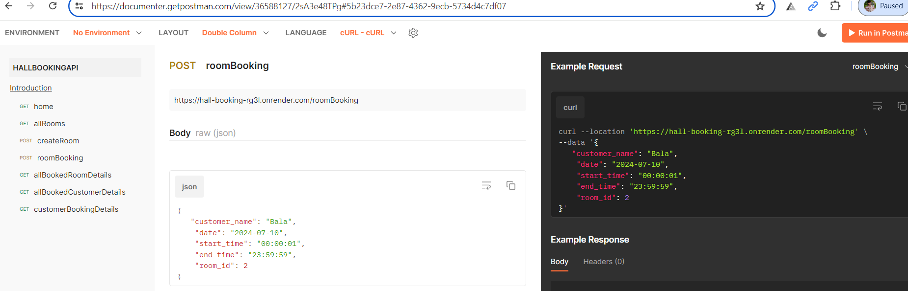

# Project Title

Hall Booking API

## App deployed in Render

https://hall-booking-rg3l.onrender.com/

## Documentation

Using Express and node this app will help you book hotel rooms.

# 💻 Tech Stack:

## Demo

Test using Postman:

- Check Home Page - GET (https://hall-booking-rg3l.onrender.com/)
- Get all Available Rooms - GET (https://hall-booking-rg3l.onrender.com/allRooms)
- Create a new Room - POST (https://hall-booking-rg3l.onrender.com/createRoom)
- Book a Room - POST (https://hall-booking-rg3l.onrender.com/roomBooking)
- Get all Booked room details - GET (https://hall-booking-rg3l.onrender.com/allBookedRoomDetails)
- Get all Booked customer details - GET (https://hall-booking-rg3l.onrender.com/allBookedCustomerDetails)
- Get cusomer booking details - GET (https://hall-booking-rg3l.onrender.com/customerBookingDetails/Bala)

## API documentation

https://documenter.getpostman.com/view/36588127/2sA3e48TPg

## Screenshot

